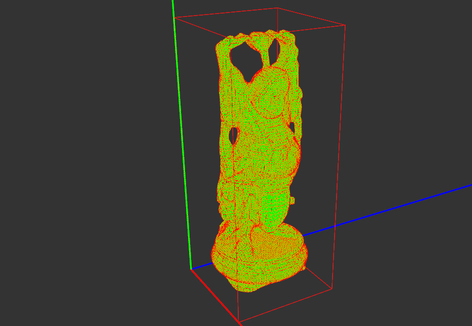

# [BUT FIT 2020] 3D Surface reconstruction from point clouds
VGE (Computational Geometry) school course project.
Showcase of reconstruction methods provided by PCL library
and two custom methods implemented by authors.

## Compilation
1. Install all dependencies
2. Use provided CMake

## Dependencies (Ubuntu)
* **[OpenGL (mesa-utils)](https://www.opengl.org/)**
* **[GLEW (libglew-dev)](http://glew.sourceforge.net/)**
* **[SDL2 (libsdl2-dev)](https://www.libsdl.org/)**
* **[PCL 1.7+ (libpcl-dev)](https://pointcloudlibrary.github.io/)**

## Authors
* **Ondřej Pavela**
* **Jan Brukner**